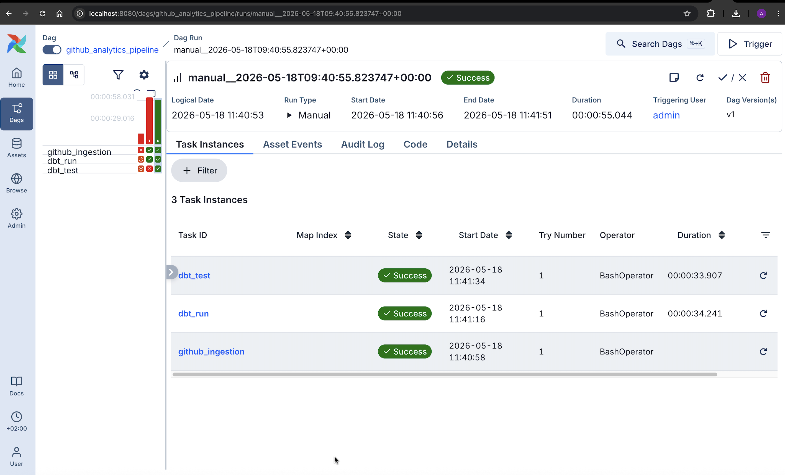

# Engineering Analytics Platform

Production-style analytics engineering platform built with Python, BigQuery, dbt, and Airflow to automate GitHub data ingestion, transformation, orchestration, and data quality testing.

---

## Architecture

GitHub API → Python ETL → BigQuery → dbt Models & Tests → Airflow Orchestration

---

## Tech Stack

- Python
- SQL
- BigQuery
- dbt
- Apache Airflow
- Pandas
- GitHub API

---

## Features

- Automated GitHub repository ingestion
- BigQuery cloud warehouse integration
- dbt transformation models
- Automated dbt data quality tests
- Airflow DAG orchestration
- Analytics-ready datasets for engineering productivity insights

---

## Airflow Pipeline Execution

Successful orchestration of ingestion, dbt run, and dbt test workflows using Apache Airflow.

