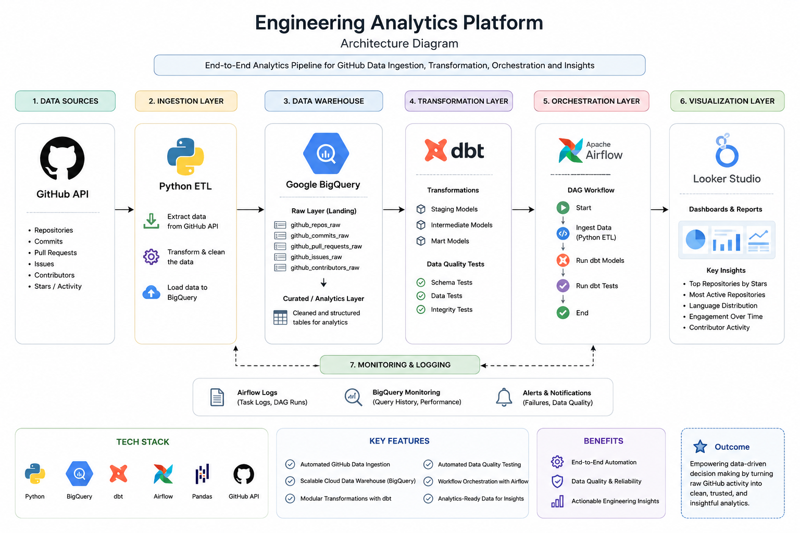
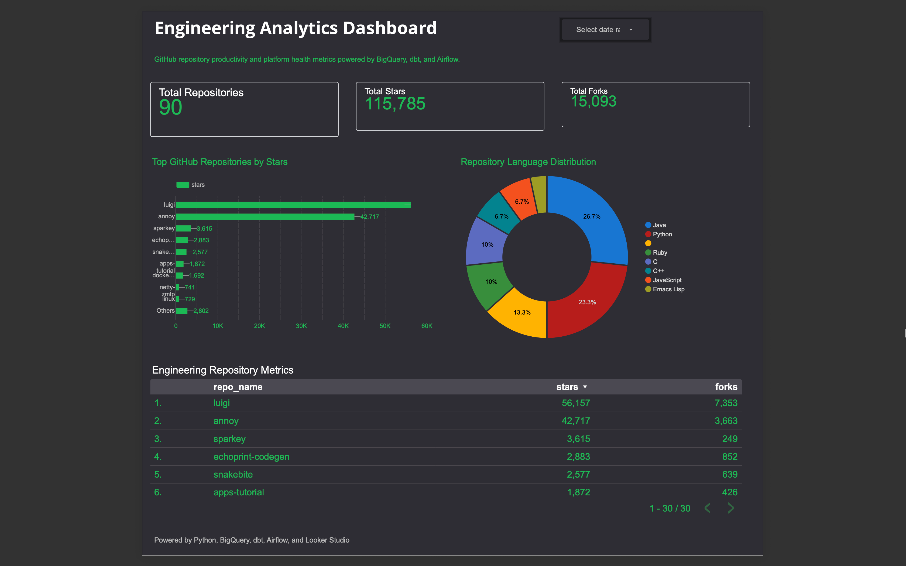

# Engineering Analytics Platform

Production-style analytics engineering platform built with Python, BigQuery, dbt, and Airflow to automate GitHub data ingestion, transformation, orchestration, and data quality testing.

---

## Architecture

GitHub API → Python ETL → BigQuery → dbt Models & Tests → Airflow Orchestration

---

## Tech Stack

- Python
- SQL
- BigQuery
- dbt
- Apache Airflow
- Pandas
- GitHub API

---

## Features

- Automated GitHub repository ingestion
- BigQuery cloud warehouse integration
- dbt transformation models
- Automated dbt data quality tests
- Airflow DAG orchestration
- Analytics-ready datasets for engineering productivity insights

---

## Airflow Pipeline Execution

Successful orchestration of ingestion, dbt run, and dbt test workflows using Apache Airflow.

## Architecture Diagram

End-to-end analytics engineering workflow for GitHub data ingestion, transformation, orchestration, testing, and visualization.

## Analytics Dashboard

Built an interactive engineering analytics dashboard in Looker Studio connected to BigQuery to visualize repository productivity metrics, engineering activity insights, language distribution, and repository performance trends.

### Dashboard Preview

### Dashboard Features
- Repository productivity metrics and KPIs
- Top GitHub repositories by stars
- Repository language distribution analysis
- Engineering repository performance tracking
- Interactive filtering and analytics visualization

### Tech Stack
Python • BigQuery • dbt • Apache Airflow • Looker Studio